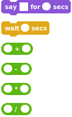

# coro-scratch
A Scratch to Python transpiler that makes extensive use of coroutines

coro-scratch is a simple command line tool that can convert Scratch projects to .py source files that can be run in any Python version greater than or equal to 3.4. It makes extensive use of asyncio and coroutines in the transpiled files.

# How does it work?
A longstanding problem with transpiling Scratch projects to other languages is how to deal with its concurenncy model. The transpiled programs can't use threads because the scripts in a Scratch project only yield at specific places, while threads can yield at any time. Since most programming languages only have threads (or multiple processes, which would be even less suitable) for managing concurenncy, this has meant that most Scratch to X "transpilers" really just embed an interpreter and a project together. coro-scratch gets around this by using coroutines, which are like normal subroutines, but they can be "paused" and "unpaused" at specific points. This allows the transpiled code to yield just like Scratch would.

# How complete is this?
This is just a prototype for how a Scratch to Python transpiler might work. As such, it only supports a very small amount of blocks:

Also, the programs created by coro-scratch are CLI only, no graphics or sound blocks will be supported any time soon (except for say for, which just prints to the console.)

# Usage
Clone this repo, and run `python3 convert.py infile.sb2 outfile.py`

The generated programs must be run on Python3.4+ and they must be able to import the runtime.py file. This might change in the future.

# License
coro-scratch is released under the MIT license, see LICENSE.txt for details.
